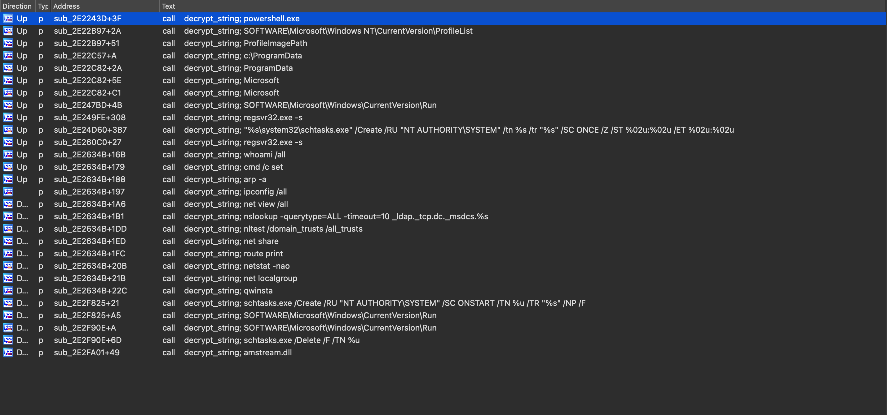
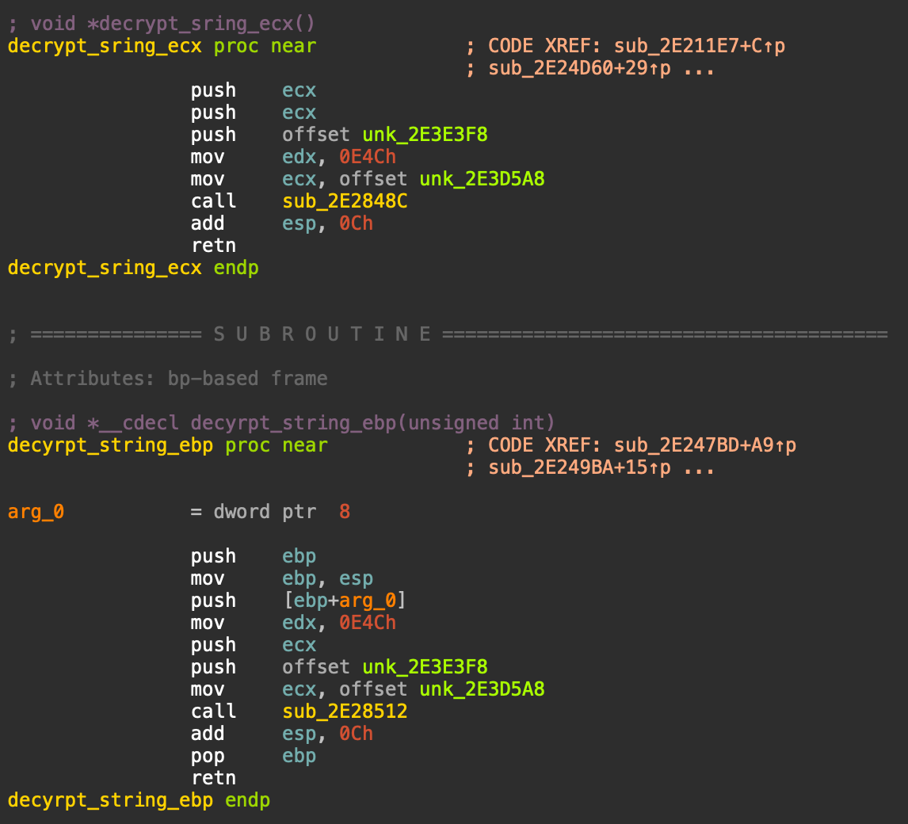
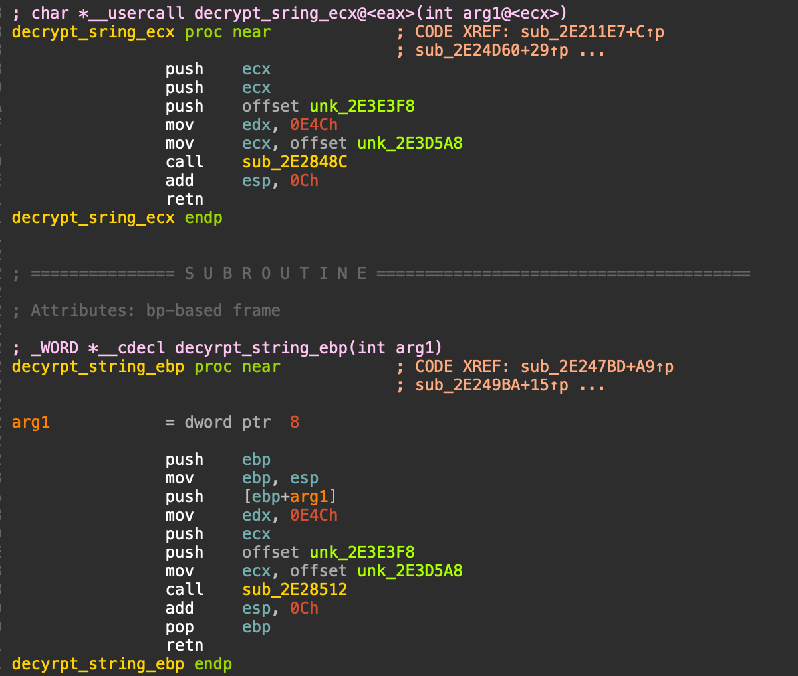
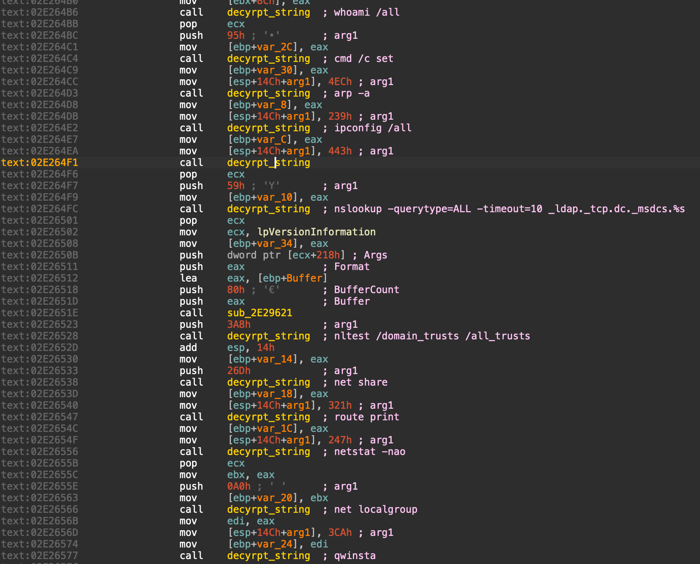

# Qbot-Strings-Decrypter
An IDA pro python script to decrypt Qbot malware strings.

Tested and working with Qbot OBAMA111 https://www.malware-traffic-analysis.net/2021/10/07/index.html 

Before using the script make sure to fix the calling convention of the decryption functions like below.

All the decrypted string will be placed as comment next to the decrypt string function call.

